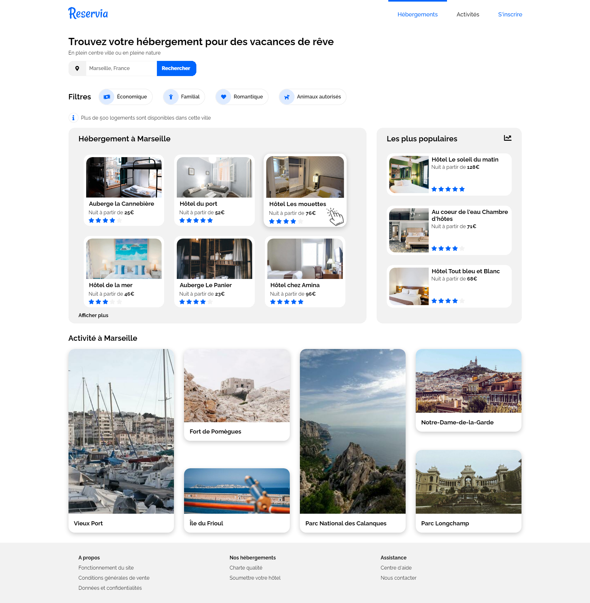
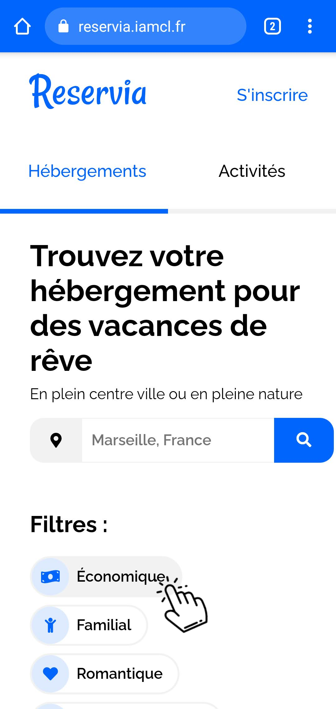

<!-- PROJECT LOGO -->
 

  

  <h3 align="center">RÉSERVIA</h3>

  

    Reservia, une petite entreprise proposant un outil de planification de vacances.
     
    <a href="https://reservia.iamcl.fr"><strong>ALLER SUR LE SITE </strong></a>
  

<!-- ABOUT THE PROJECT -->
## À PROPOS DU PROJET :
### VERSION DESKTOP :
  

    
  

### VERSION MOBILE :
  

    
  

### LANGUAGES & LIBRAIRIES & FONTS
* [HTML](https://github.com/iamclfr/LafargueClement_2_02032021/search?l=html)
* [CSS](https://github.com/iamclfr/LafargueClement_2_02032021/search?l=CSS)
* [FONTAWESOME](https://fontawesome.com)
* [RALEWAY](https://fonts.google.com/specimen/Raleway)

<!-- GETTING STARTED -->
## PROJET RÉSERVIA

### SCÉNARIO :

Enfin, vous avez trouvé votre premier stage en tant que développeur web chez Reservia, une petite entreprise proposant un outil de planification de vacances. Leur site permet aux usagers de trouver des hébergements et des activités dans la ville de leur choix. Les hébergements peuvent également être filtrés par thématique, par exemple leur budget ou leur ambiance.
Un nouveau design basé sur les principes du Material Design vient d’être proposé par Loïc, designer UI.   
Avant de valider définitivement ce design, l’entreprise décide de réaliser un prototype. La première étape consiste à intégrer la maquette responsive en HTML et CSS. Voici donc la tâche qui vous est attribuée ! Loïc vous envoie un mail pour vous en dire plus, en mettant en copie votre manager, Sarah, qui est CTO de l’entreprise.

### FONCTIONNALITÉS :

* Les usagers pourront rechercher des hébergements dans la ville de leur choix. Le champ de recherche est donc un champ de saisie, dont le texte peut être édité par l’usager. En revanche, à ce stade, le bouton de recherche ne sera pas fonctionnel.
* Chaque carte d’hébergement ou d’activité devra être cliquable dans son intégralité. Pour l’instant les liens seront vides.
* Les filtres ne seront pas fonctionnels pour cette version, en revanche, il faut qu’ils changent d’apparence au survol. Je te laisse décider de l’effet le plus approprié.
* Dans le menu, les liens “Hébergements” et “Activités” sont des ancres qui doivent mener aux sections de la page.

### CONTRAINTES TECHNIQUES :
* Je te fournis deux maquettes : l’une desktop et l’autre mobile. Le site devra également être adapté aux tablettes. Sur ce support, tu es libre de faire les adaptations nécessaires avec la mise en page, tant qu’aucun élément n’est coupé et que le texte a une taille suffisante. Je te laisse choisir les breakpoints appropriés.
* Comme je ne savais pas de quels tailles et formats d’image tu avais besoin, j’ai exporté les images en différents formats. Je te laisse choisir le format le plus adapté par rapport à la résolution et au temps de chargement.
* Les icônes proviennent de la bibliothèque [Font Awesome](https://fontawesome.com). Les couleurs de la charte sont le bleu #0065FC, et sa version plus claire #DEEBFF ainsi que le gris pour le fond #F2F2F2.
* La police du site est [Raleway](https://fonts.google.com/specimen/Raleway).

## MES OUTILS
#### ÉDITEUR DE CODE : [IntelliJ IDEA](https://www.jetbrains.com/fr-fr/idea/)
#### NAVIGATEURS : [VIVALDI](https://vivaldi.com) & [CHROME](https://www.google.com/intl/fr/chrome/) ...
#### OS : [WINDOWS 10 PRO](https://www.microsoft.com/fr-fr/p/windows-10-pro/df77x4d43rkt?rtc=1&activetab=pivot:overviewtab)

<!-- CONTACT -->
## CONTACTEZ MOI

[@iamcl_fr](https://twitter.com/iamcl_fr) & [lafargue.pro@gmail.com](mailto:lafargue.pro@gmail.com) & [https://iamcl.fr](https://iamcl.fr)

<!-- MARKDOWN LINKS & IMAGES -->
[contributors-shield]: https://img.shields.io/github/contributors/iamclfr/repo.svg?style=for-the-badge
[contributors-url]: https://github.com/iamclfr/repo/graphs/contributors
[forks-shield]: https://img.shields.io/github/forks/iamclfr/repo.svg?style=for-the-badge
[forks-url]: https://github.com/iamclfr/repo/network/members
[stars-shield]: https://img.shields.io/github/stars/iamclfr/repo.svg?style=for-the-badge
[stars-url]: https://github.com/iamclfr/repo/stargazers
[issues-shield]: https://img.shields.io/github/issues/iamclfr/repo.svg?style=for-the-badge
[issues-url]: https://github.com/iamclfr/repo/issues
[license-shield]: https://img.shields.io/github/license/iamclfr/repo.svg?style=for-the-badge
[license-url]: https://github.com/iamclfr/repo/blob/master/LICENSE.txt
[linkedin-shield]: https://img.shields.io/badge/-LinkedIn-black.svg?style=for-the-badge&logo=linkedin&colorB=555
[linkedin-url]: https://www.linkedin.com/in/clément-lafargue-40503318a/
